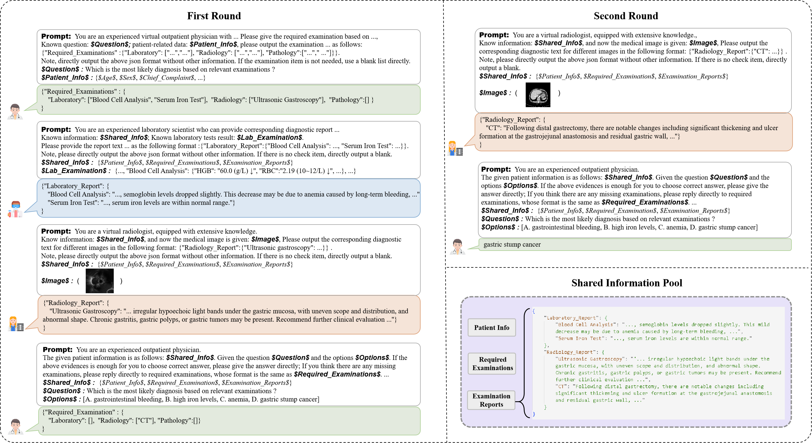

# [Paper] Integration of Multi-Source Medical Data for Medical Diagnosis Question Answering
The repository is for the paper "Integration of Multi-Source Medical Data for Medical Diagnosis Question Answering"

The main contributions can be summarized as follows:
(i) We explore a medical question-answering task based on multi-source data, named medical diagnosis question answering (MedDQA) task.
(ii) We introduce a new dataset constructed from real medical data as a foundation for future research.
(iii) We propose a multi-agent system where each agent can selectively handle specific data sources.

## Data

Please check the Drive: xxx

## Implementations

Coming soon.

## Note

Our dataset is currently undergoing ethical review by the hospital. It will be made publicly available once the review process is completed.